# Setting Up GitHub Actions for Fly.io Deployment

This guide shows how to set up automatic deployments to Fly.io on every push to master.

## Prerequisites

1. Fly.io account and apps created
2. GitHub repository with your code
3. Fly.io API token

## Step 1: Get Your Fly.io API Token

```bash
# Login to Fly.io
fly auth login

# Create a deploy token
fly tokens create deploy -x 999999h
```

Copy the token that's displayed - you'll need it in the next step.

## Step 2: Add Token to GitHub Secrets

1. Go to your GitHub repository
2. Click **Settings** → **Secrets and variables** → **Actions**
3. Click **New repository secret**
4. Name: `FLY_API_TOKEN`
5. Value: Paste the token from Step 1
6. Click **Add secret**

## Step 3: Verify Fly.io App Names

Make sure your Fly.io apps exist. If not, create them:

```bash
# Check existing apps
fly apps list

# Create apps if needed (these should already exist from earlier setup)
fly apps create status-app-commands
fly apps create status-app-api
fly apps create status-app-projections
fly apps create status-app-slackbot
fly apps create status-app-scheduler
```

## Step 4: Push to GitHub

The workflow is already committed. Just push:

```bash
git push origin master
```

## Step 5: Monitor Deployment

1. Go to your GitHub repository
2. Click **Actions** tab
3. Click on the latest workflow run
4. Watch the progress:
   - **Test job**: Runs unit and E2E tests
   - **Deploy job**: Deploys all 5 apps to Fly.io (runs only after tests pass)

## What Happens on Each Push

```mermaid
graph LR
    A[Push to master] --> B[Run Unit Tests]
    B --> C[Run E2E Tests]
    C --> D{Tests Pass?}
    D -->|Yes| E[Deploy All Apps]
    D -->|No| F[Stop - Fix Tests]
    E --> G[✅ Live on Fly.io]
```



### Jobs:

**Test Job:**
- Checks out code
- Sets up Go 1.21
- Downloads dependencies
- Runs unit tests (fast)
- Runs E2E tests with Docker (real PostgreSQL)

**Deploy Job** (only runs if tests pass):
- Deploys 5 apps in parallel:
  - Commands service
  - API service
  - Projections service
  - Slackbot service
  - Scheduler service

## Deployment Settings

- **Trigger**: Every push to `master` branch
- **Tests**: Must pass before deployment
- **Strategy**: Parallel deployment of all services
- **Build**: Remote build on Fly.io (faster, no local Docker needed)

## Troubleshooting

### "FLY_API_TOKEN not found"
**Solution:** Add the token to GitHub Secrets (see Step 2)

### "App not found"
**Solution:** Create the Fly.io apps first:
```bash
fly apps create status-app-commands
fly apps create status-app-api
# etc...
```

### Tests failing in CI
**Solution:** Run tests locally first:
```bash
make test
```

### Deployment fails
**Solution:** Check logs in GitHub Actions, or deploy manually:
```bash
fly deploy --config fly.toml
```

## Manual Deployment

You can still deploy manually:

```bash
# Deploy specific service
fly deploy --config fly.api.toml

# Deploy all services
./deploy.sh
```

## Skipping Deployment

To push without deploying, use a different branch:

```bash
git checkout -b feature-branch
git push origin feature-branch
# No deployment happens
```

Only pushes to `master` trigger deployment.

## Benefits

✅ **Automated Testing** - Every push runs tests  
✅ **Safe Deployments** - Only deploys if tests pass  
✅ **Fast Feedback** - Know immediately if something breaks  
✅ **Parallel Deploys** - All services deploy simultaneously  
✅ **Zero Downtime** - Fly.io handles rolling deployments  

## Next Steps

Once set up, your workflow is:

1. Make changes locally
2. Run `make test` to verify
3. Commit and push to master
4. GitHub Actions automatically tests and deploys
5. Check Fly.io apps are updated

That's it! 🚀
